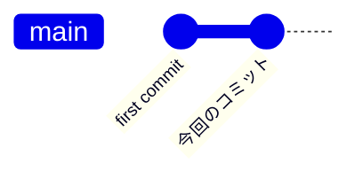
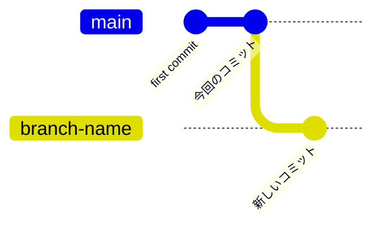
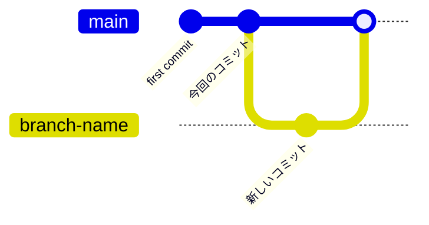

# git使い方基礎編

## git設定

### 初期設定

```bash
git config user.name "kanaemg"
git config user.email "kanaemg@gmail.com"
```
Gitのユーザー名とメールアドレスを設定します。これらはコミットのメタデータとして使用されます。
ローカルだけでなく、グローバル設定を行う場合は、`--global`オプションを追加します。

#### マージの戦略設定
```bash
git config pull.rebase false
```
マージをデフォルトの動作に設定します。これにより、`git pull`を実行した際に、マージコミットが作成されます。  
参考: [Git 2.27 での git pull 時の warning について](https://qiita.com/tearoom6/items/0237080aaf2ad46b1963)


## git基本的な利用方法

### 基本的なコミットの進め方
gitで管理されるファイルは、それぞれ、作業ツリー、ステージングエリア、リポジトリの3つの場所で管理されます。
作業ツリーで変更を加えた後、ステージングエリアに追加し、最終的にリポジトリにコミットします。

#### リポジトリのクローン
```bash
git clone <repository-url>
```
すでにリモート（GitHubやGitLabなど）にリポジトリが存在する場合、そのリポジトリをローカルにクローンします。

#### リポジトリ初期化
```bash
git init
```
新規に既存のディレクトリからリポジトリを作成する場合は、`git init`を指定のディレクトリで実行すると、そのディレクトリがGitリポジトリとして初期化され、ステージングエリアとリポジトリが作成されます。

#### 変更のステージング
```bash
git add <file>
```
作業ツリーに行った変更をステージングエリアに追加します。特定のファイルを指定するか、すべての変更を追加する場合は`git add .`を使用します

#### ステージングされたファイルの削除
```bash
git reset <file>
```
間違ったファイルをステージングした場合など、ステージングエリアから特定のファイルを削除します。全てのステージングを削除したい場合は`git reset .`を使用します。ファイルへの変更は保持されます。

#### 変更のコミット
```bash
git commit -m "今回のコミット"
```
ステージングエリアの変更をコミットします。`-m`オプションでコミットメッセージを指定します。



---

### リモートレポジトリ

#### リモートリポジトリからのフェッチ
```bash
git fetch -p
```
複数人でリモートリポジトリを共有して作業している場合、リモートに変更が加えられている場合があります。リモートの変更を確認し、ローカルに反映します。`-p --prune`オプションでリモートになくなった不要なブランチを削除します。

#### リモートリポジトリのチェックアウト
```bash
git checkout -b <branch-name> origin/<branch-name>
```
リモートリポジトリのブランチをチェックアウトします。新しいローカルブランチが作成され、リモートブランチが追跡されます。

#### リモートリポジトリへのプッシュ
```bash
git push origin <branch-name>
```
ローカルの変更をリモートリポジトリにプッシュします。

---

### ブランチの操作

#### ブランチの作成
```bash
git branch <branch-name>
```
新しいブランチを作成します。作成したブランチは、現在のブランチから分岐します。


#### ブランチの切り替え
```bash
git checkout <branch-name>
```
指定したブランチに切り替えます。ブランチが存在しない場合は、エラーが発生します。

#### ブランチのマージ
```bash
git merge <branch-name>
```
現在のブランチに指定したブランチの変更をマージします。競合が発生した場合は、手動で解決する必要があります。



#### ブランチの削除
```bash
git branch -d <branch-name>
```
指定したブランチを削除します。ブランチがマージされていない場合は、`-D`オプションを使用して強制的に削除します。

#### リモートブランチの削除
```bash
git push origin --delete <branch-name>
```
リモートリポジトリから指定したブランチを削除します。（リモートのブランチを削除するパターンはGitHubなどのホスティングサービスを利用する場合はあまりないかもしれません。pullリクエストがマージされた後に削除することが一般的です。）

#### 現在のブランチの確認
```bash
git branch -vv
```
現在のブランチとその追跡状態を確認します。`-vv`オプションを使用すると、各ブランチの最新のコミットメッセージやリモート情報も表示されます。


## gitの小技・便利技

### stashの利用
ファイルに変更を加えたが、まだコミットしたくない場合。他の作業を行いたいので一度変更を待避して別のブランチを切り替えたい場合などは良くあります。
作業ツリーに加えた変更を一時的に保存して、後で復元するための機能です。特に作業中の変更を一時的に退避させたい場合に便利です。

#### ステージングしてない変更の保存
```bash
git stash
```
ステージングしていない変更を一時的に保存します。後で`git stash pop`で復元できます。

#### 未トラッキングファイルのある場合の保存
```bash
git stash -u
```
`-u`でトラッキングしていないファイルも含めて、すべての変更を一時的に保存します。後で`git stash pop`で復元できます。

#### stashした変更の復元
```bash
git stash pop
```
最後に保存したstashを復元し、スタッシュから削除します。

### コミットのやり直り
人間なので間違えることは必ずあります。一度コミットをしたが、コミットメッセージを変更したい場合や、コミット内容を修正したい場合というのはよくあります。ここでは様々な、コミットのやり直し方法を紹介します。

#### 最後のコミットメッセージの変更
```bash
git commit --amend -m "新しいコミットメッセージ"
```
最後のコミットメッセージを変更します。`--amend`オプションを使用すると、最後のコミットを修正できます。

#### 最後のコミット内容の変更
```bash
git commit --amend
```
最後のコミットに新しい変更を追加します。ステージングエリアに変更がある場合、それらを最後のコミットに追加します。これにより、コミットの内容が更新されます。


---
